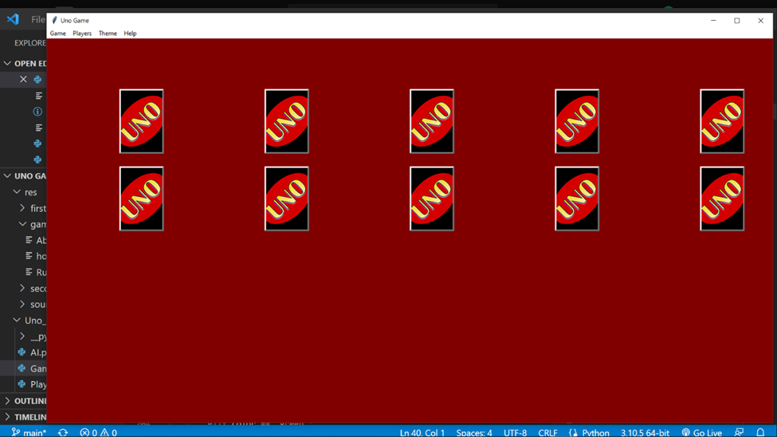
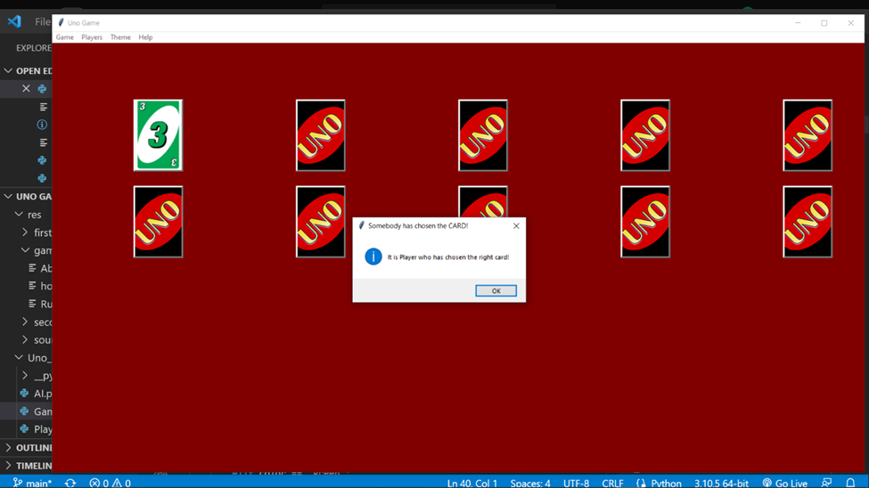

# Uno_Game_Python

Python project for 01286121 Computer Programming KMITL
Software Engineering Program, Year 1, Semester 1

More details, [pdf file](/Python_Project_report.pdf)

## Table of Contents

- [Introduction](#introduction)
- [Features](#features)

## Introduction

This is a small GUI-based game where user can interact 
with cards to find out the card that the program will randomly choose. This can be used 
when people want to choose which person to do something. This is similar to a lottery 
game or rock-paper-scissor game that decides which person goes first or goes last.

## Features
This is the first loading page when the game is started

In this menu, there are two options, i.e., “New Game” with a sub-menu which lets you choose 10 cards or 20 cards to play with, and “Close“ that allows to exit the program

In this Players menu, there are two modes, “Single player with AI”, a default mode in which you can play with an AI and “Multiplayer”, in which you can play alone or with others.
Users can choose any mode anytime, during the game or before starting the game.

This “Background Color” will allow you to change the whole window into any type of color, based on your choice.

The window will change its color based on the color you picked in the color picker pop-up window

You can see a short introduction about how to play and my personal information in this menu

# Playing the game
I chose a new game with 10 cards and set the background color to brown

By default, it is a single player with AI mode, so whenever you clicked a card, an AI will automatically choose next card.

I was lucky this time. The first one is the card the program has chosen, and I clicked it so, it pops out a message box to let me know that I won the game and when I clicked ok,

It will ask me to start a new game or close the program. If I clicked OK again, 

It will get back to its original state.
This time, I chose to play with my friends or alone. If I play with my friends in real time, we are going to play in turn and wait for someone to pick the right card.

Who wins?

After a while playing the game, if someone chooses the right card, it will show as the same as before. And the program will ask you to create a new game or not
